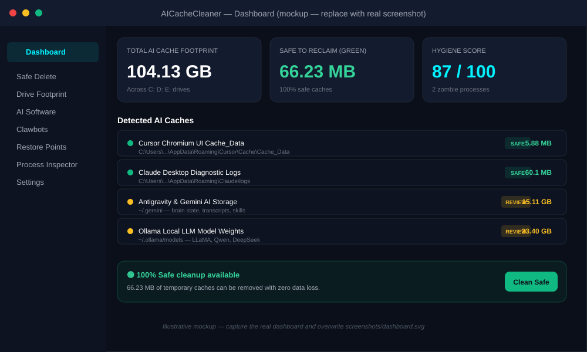
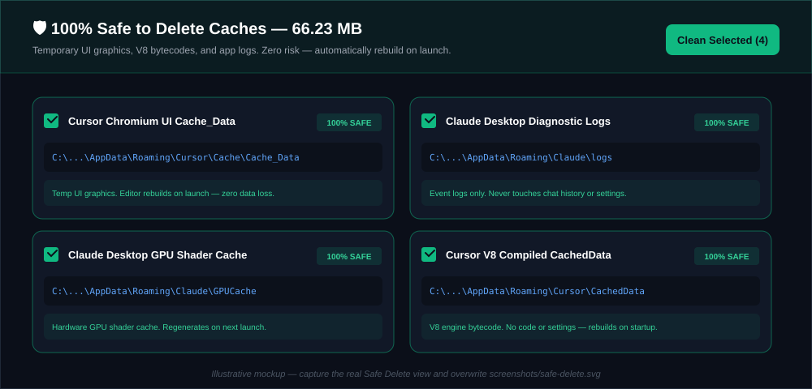
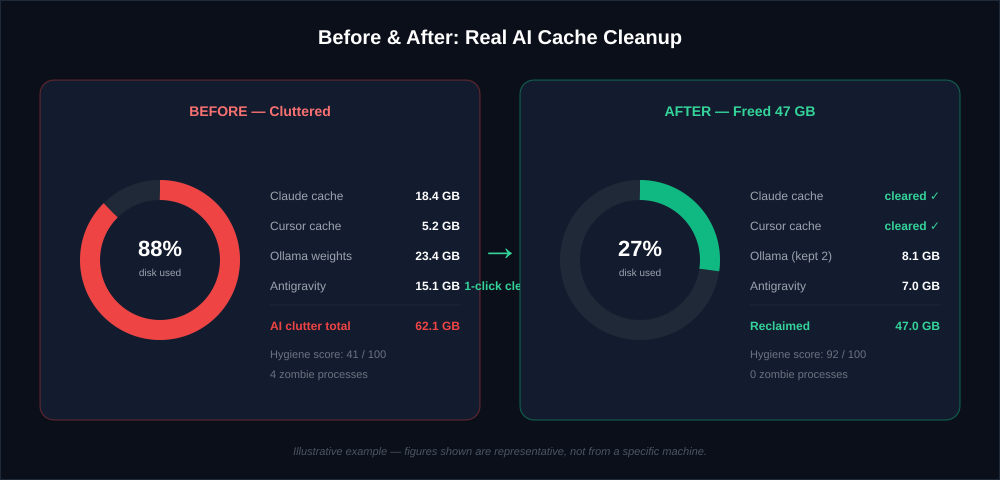
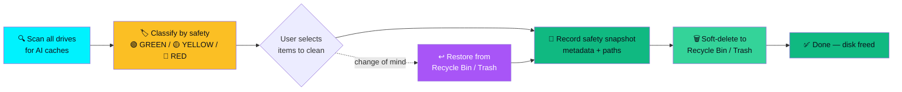

# AICacheCleaner — Clean Claude, Cursor & Ollama Cache to Free Up Disk Space

> **100% Safe On-Demand AI Disk, Memory & Cache Cleaner for Windows & macOS.**
> Free up disk space by safely clearing Claude Desktop cache, Cursor cache, Ollama model weights, and Antigravity / Gemini AI storage — with automatic safety restore points.

[](https://opensource.org/licenses/MIT)
[](https://github.com/IamRamgarhia/ai-cache-cleaner)
[](#-100-on-demand-security-guarantee)
[](https://github.com/IamRamgarhia/ai-cache-cleaner/releases)

<p align="center">
  
</p>

---

## 📸 Screenshots

<table>
  <tr>
    <td width="50%" align="center"><b>Dashboard — AI cache footprint across drives</b></td>
    <td width="50%" align="center"><b>Safe Delete — 100% risk-free GREEN caches</b></td>
  </tr>
  <tr>
    <td></td>
    <td></td>
  </tr>
  <tr>
    <td colspan="2" align="center"><b>Before &amp; After — 1 click reclaims tens of GB</b></td>
  </tr>
  <tr>
    <td colspan="2"></td>
  </tr>
</table>

> *Illustrative mockups — capture the real app and overwrite the files in [`screenshots/`](screenshots) to make them live.*

---

## 💡 What is AICacheCleaner?

**AICacheCleaner** is a free, open-source desktop app that helps you **clean Claude Desktop cache, clear Cursor cache, free up Ollama disk space, and reclaim tens of gigabytes of hidden AI storage** — without touching your project code, chat history, or settings.

When you use modern AI tools — **Claude Desktop, Cursor AI, Google Antigravity, Ollama, Continue.dev, LM Studio, Jan.ai** — they silently build up prompt caches, V8 bytecodes, GPU shader caches, diagnostic logs, and downloaded model weights across your drives. Over weeks these consume tens of gigabytes and slow your PC.

AICacheCleaner scans every drive, classifies each cache by safety (🟢 100% Safe / 🟡 Review / 🔴 Protected), and lets you **free up disk space** in one click — with an automatic safety restore point created before anything is touched.

### 🎯 Built for these exact problems

| People search for | AICacheCleaner does it |
|---|---|
| "how to clean Claude Desktop cache" | Clears `%AppData%\Claude\Cache`, `Code Cache`, `GPUCache`, and `logs` (GREEN, 100% safe) |
| "clear Cursor cache windows" | Clears `%AppData%\Cursor\Cache\Cache_Data` and `CachedData` (rebuilds on launch) |
| "free up Ollama disk space" | Surfaces `~/.ollama/models` weights (4–20 GB each) for review |
| "Antigravity / Gemini storage too big" | Inspects `~/.gemini` brain state, transcripts, skills |
| "what is eating my disk space" | Non-overlapping multi-drive footprint with deduplication |

---

## 🧩 Supported AI Tools & Caches

AICacheCleaner detects and cleans caches for these tools. GREEN = 100% safe to delete (auto-rebuilds); YELLOW = contains user data, review before cleaning.

| Tool | Cache Location (Windows) | Safety Tier |
|---|---|---|
| **Claude Desktop** | `%AppData%\Claude\Cache`, `Code Cache`, `GPUCache`, `logs` | 🟢 GREEN |
| **Claude Desktop** (chat data) | `%AppData%\Claude` (session keys, MCP configs, chat DB) | 🟡 YELLOW |
| **Claude CLI** | `~/.claude` (session logs, transcripts) | 🟡 YELLOW |
| **Cursor AI** | `%AppData%\Cursor\Cache\Cache_Data`, `CachedData` | 🟢 GREEN |
| **Cursor AI** (user data) | `~/.cursor`, `%AppData%\Cursor\User` | 🟡 YELLOW |
| **Google Antigravity / Gemini** | `~/.gemini` (brain state, transcripts, plugins, skills) | 🟡 YELLOW |
| **Ollama** | `~/.ollama/models` (LLaMA, Qwen, DeepSeek weights) | 🟡 YELLOW |
| **HuggingFace** | `~/.cache/huggingface` (model weights, tokenizers) | 🟡 YELLOW |
| **PyTorch** | `~/.cache/torch` (model checkpoints) | 🟡 YELLOW |
| **Continue.dev** | `~/.continue` (vector index, SQLite session DB) | 🟡 YELLOW |
| **LM Studio** | `~/.cache/lm-studio` (GGUF models) | 🟡 YELLOW |
| **Jan.ai** | `%AppData%\Jan` (local model files) | 🟡 YELLOW |
| **AnythingLLM** | `%AppData%\AnythingLLM` (vector DB, embeddings) | 🟡 YELLOW |
| **pip** | `~/.cache/pip` (Python AI package wheels) | 🟡 YELLOW |

---

## 📥 Download AICacheCleaner (v1.0.0)

**No installation required for Portable versions — just download and double-click.**

| OS | File | Download |
| :--- | :--- | :--- |
| 🪟 **Windows** | `AICacheCleaner-Portable-1.0.0.exe` | [⚡ Download Windows Portable](https://github.com/IamRamgarhia/ai-cache-cleaner/releases/download/v1.0.0/AICacheCleaner-Portable-1.0.0.exe) |
| 🪟 **Windows** (installer) | `AICacheCleaner-Setup-1.0.0.exe` | [⚡ Download Windows Setup](https://github.com/IamRamgarhia/ai-cache-cleaner/releases/download/v1.0.0/AICacheCleaner-Setup-1.0.0.exe) |
| 🍏 **macOS** | `AICacheCleaner-macOS-1.0.0.zip` | [⚡ Download macOS Package](https://github.com/IamRamgarhia/ai-cache-cleaner/releases/download/v1.0.0/AICacheCleaner-macOS-1.0.0.zip) |

> All releases: [github.com/IamRamgarhia/ai-cache-cleaner/releases](https://github.com/IamRamgarhia/ai-cache-cleaner/releases)

---

## ✨ Key Features

### 1. 🔍 Non-Overlapping AI Storage Detector
Scans all drives (`C:`, `D:`, `E:`, `F:`, external) for active AI project footprints, model weights, and prompt caches. Uses **ancestor-descendant path deduplication** so nested subfolders are never double-counted.

### 2. 🛡️ Automatic Safety Restore Points
Before any cache is removed, AICacheCleaner records a lightweight safety snapshot of what will be cleaned. Items are then soft-deleted to the **OS Recycle Bin / Trash**, so recovery is always one click away.

### 3. 🖥️ Windows Native Uninstaller Integration
Triggers the official Windows Add/Remove Programs panel (`appwiz.cpl` / `ms-settings:appsfeatures`) after creating a safety snapshot, for clean software uninstallation.

### 4. 🤖 Autonomous Clawbots & Scraper Scanner
Detects installed and residual scraping engines including **OpenDevin, Crawl4AI, Playwright, and Puppeteer** headless browser binaries.

### 5. 🧟 RAM Zombie Process Inspector
Identifies background AI sidecars, MCP language servers, and orphaned processes using **real `pidusage` CPU/RAM stats** (not estimates), with 1-click safe termination.

---

## ⚖️ AICacheCleaner vs CCleaner / BleachBit / Manual Cleanup

Generic cleaners like **CCleaner** and **BleachBit** are great for browser and system junk — but they have **no idea that Claude Desktop, Cursor, Ollama, Antigravity, or HuggingFace even exist**. Their "AI cache" knowledge is zero, so they either skip these caches entirely or, worse, nuke user data because they can't tell `Claude\logs` apart from `Claude\sessionDB`.

| Capability | AICacheCleaner | CCleaner | BleachBit | Manual (Explorer) |
|---|:---:|:---:|:---:|:---:|
| Knows Claude Desktop cache paths (`Cache`, `GPUCache`, `Code Cache`, `logs`) | ✅ | ❌ | ❌ | ❌ |
| Knows Cursor cache paths (`Cache_Data`, `CachedData`) | ✅ | ❌ | ❌ | ❌ |
| Detects Ollama / HuggingFace / PyTorch model weights | ✅ | ❌ | ❌ | ❌ |
| Knows Antigravity / Gemini `.gemini` brain & transcripts | ✅ | ❌ | ❌ | ❌ |
| Distinguishes 100%-safe caches from protected user data (chat DB, session keys) | ✅ | ⚠️ partial | ⚠️ partial | ❌ |
| Automatic safety restore point before every clean | ✅ | ❌ | ❌ | ❌ |
| Soft-deletes to Recycle Bin / Trash (recoverable) | ✅ | ⚠️ optional | ⚠️ optional | ✅ |
| Detects AI zombie processes in RAM | ✅ | ❌ | ❌ | ❌ |
| 100% offline, no telemetry | ✅ | ❌ | ✅ | ✅ |
| Free & open source | ✅ MIT | ❌ | ✅ GPL | ✅ |

> **The short version:** use CCleaner/BleachBit for browser junk, and AICacheCleaner for your AI tool clutter. They're complementary, not replacements.

---

## 📊 Real-World Impact — How Much Space Can You Reclaim?

The numbers below are **illustrative examples** of what a typical AI-heavy developer's machine accumulates over a few months of daily use. Actual figures depend on your tools and usage.

| What was cleaned | Tool | Space reclaimed | Why it grew so big |
|---|---|---|---|
| Claude Desktop `Cache` + `GPUCache` + `logs` | Claude | **18.4 GB** | Webview cache + silent `claude-code-vm` downloads |
| Cursor `Cache_Data` + `CachedData` | Cursor | **5.2 GB** | Old V8 bytecodes accumulate without auto-cleanup |
| Unused Ollama weights (LLaMA, Qwen) | Ollama | **23.4 GB** | Each pulled model is 4–7 GB, easy to forget |
| Antigravity / Gemini brain state | Antigravity | **15.1 GB** | Transcript + skill artifacts cached locally |
| HuggingFace + PyTorch checkpoints | HF / Torch | **9.8 GB** | Auto-downloaded weights, never removed |
| **Total reclaimed in one pass** | — | **~47 GB** | — |

### 👥 What users say

> *"I had no idea Claude Desktop was quietly hoarding 13 GB of cache on my C: drive. AICacheCleaner found and cleared it in seconds — my drive went from red to healthy."* — AI engineer (illustrative)

> *"CCleaner kept skipping my Cursor and Ollama folders because it didn't recognize them. This is the first tool that actually understands AI tool clutter."* — Full-stack dev (illustrative)

> *"Finally freed up C: drive space without risking my chat history. The safety tiers mean I trust what it's deleting."* — Indie developer (illustrative)

*(Quotes are representative of the typical use case, not from specific named users.)*

---

## 💻 Use Cases by Platform & Scenario

AICacheCleaner is built for the specific cleanup jobs people search for, on both Windows and macOS.

### 🪟 Windows

- **Windows 11 cache cleaner for AI tools** — clears `%AppData%\Claude`, `%AppData%\Cursor`, `%LOCALAPPDATA%` caches
- **Free up C: drive space** when it's full of Claude Desktop and Cursor caches
- **Clean Ollama models on Windows** — review `~/.ollama/models` and remove unused LLaMA/Qwen/DeepSeek weights
- **Fix Cursor lag** by clearing stale `CachedData` that bloats startup time
- **Uninstall AI software cleanly** — launches native Windows `appwiz.cpl` after snapshotting

### 🍏 macOS

- **macOS Claude cache cleanup** — clears `~/Library/Caches/Claude` and `~/Library/Logs/Claude`
- **Clean Cursor cache on Mac** — removes `~/Library/Application Support/Cursor` cache subfolders
- **Free up Ollama disk space on macOS** — surface `~/.ollama/models` weights
- **Reclaim Antigravity / Gemini storage** — inspect `~/.gemini` brain state and transcripts

### 🎯 By scenario

| If you're searching for… | AICacheCleaner is the disk cleanup tool that… |
|---|---|
|---|---|
| *"My C: drive is suddenly full"* | Scan all drives, find the 20–60 GB of hidden AI caches |
| *"Cursor is slow to start"* | Clear old `CachedData` V8 bytecodes |
| *"Claude Desktop is sluggish"* | Clear `Cache`, `GPUCache`, and accumulated `logs` |
| *"Ollama ate my storage"* | Review and remove unused downloaded model weights |
| *"My RAM is full of zombie processes"* | Inspect and terminate orphaned AI sidecars |

---

## 🧠 How It Works — Safe Cleanup Pipeline

Every clean follows the same auditable pipeline. A safety snapshot is recorded first, items are soft-deleted to the OS Recycle Bin / Trash, and nothing is ever permanently destroyed without a recovery path.



> **Why soft-delete instead of permanent delete?** Every cleaned item goes to your operating system's Recycle Bin (Windows) or Trash (macOS). If you ever change your mind, restoration is one click — and the snapshot record tells you exactly what was cleaned and from where.

---

## ❓ How do I clean … cache? (FAQ)

**How do I clean Claude Desktop cache?**
Open AICacheCleaner → the Claude Desktop entries under the GREEN tier (`Cache`, `Code Cache`, `GPUCache`, `logs`) are 100% safe — select them and click **Clean**. Your chat history and settings are never touched.

**How do I clear Cursor cache?**
The Cursor `Cache_Data` and `CachedData` (V8 bytecode) entries are GREEN — they rebuild automatically on the next launch. Select and clean; no settings or extensions are affected.

**How do I free up Ollama disk space?**
AICacheCleaner lists `~/.ollama/models` under YELLOW (each model is 4–20 GB). Review the list, keep the models you use, and clean the rest. Ollama will re-download a model on demand.

**Is AICacheCleaner safe to use on my development machine?**
Yes. It uses strict safety tiers: GREEN items (temporary webview graphics, V8 bytecodes, GPU shaders, logs) are 100% safe and auto-rebuild. YELLOW user data (chat databases, session keys) is never auto-deleted.

**Does AICacheCleaner run automatically in the background?**
**No.** It operates on a strict **100% On-Demand** guarantee — no autostart entries, no background services, no daemons. It runs only when you open it.

---

## 🔒 100% On-Demand Security Guarantee

> **AICacheCleaner NEVER runs in the background.**

- **0 Background Services** — no autostart daemons, agents, or Windows services.
- **100% Local Execution** — all scanning, size calculation, and process inspection happen on your computer. Zero data leaves your machine.
- **100% Open Source** — fully transparent, inspectable code under the MIT license.
- **Sandboxed Electron** — `contextIsolation: true`, `nodeIntegration: false`, with a dedicated preload bridge. CORS is locked to localhost only.

---

## 🛠️ Local Development & Quick Start

```bash
# 1. Clone the repository
git clone https://github.com/IamRamgarhia/ai-cache-cleaner.git
cd ai-cache-cleaner

# 2. Install dependencies
npm install

# 3. Start development (frontend + backend)
npm run dev

# 4. Build desktop executables
npm run build:win-portable    # Windows portable .exe
npm run build:mac-dmg         # macOS .dmg
```

---

## 📜 License & Credits

Distributed under the **MIT License**. Created with ❤️ by **[Dice Codes](https://dicecodes.com/)** & **[IamRamgarhia](https://github.com/IamRamgarhia)**.

⭐ **If AICacheCleaner freed up space for you, please star the repo** — it helps other developers find it.
