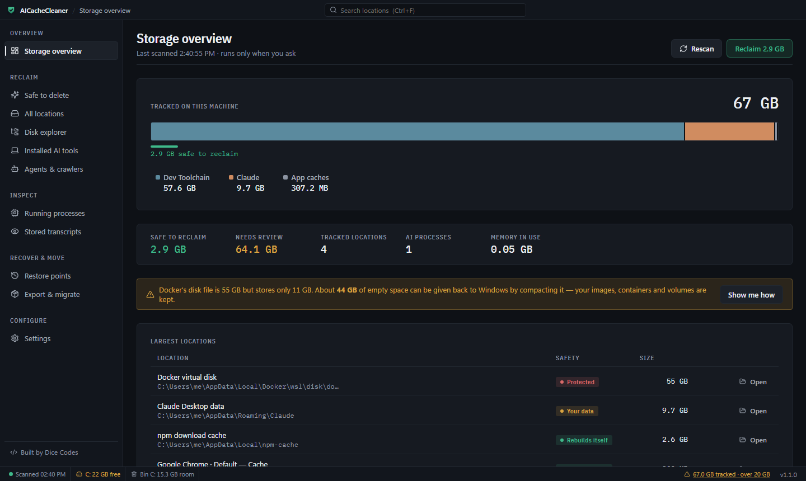
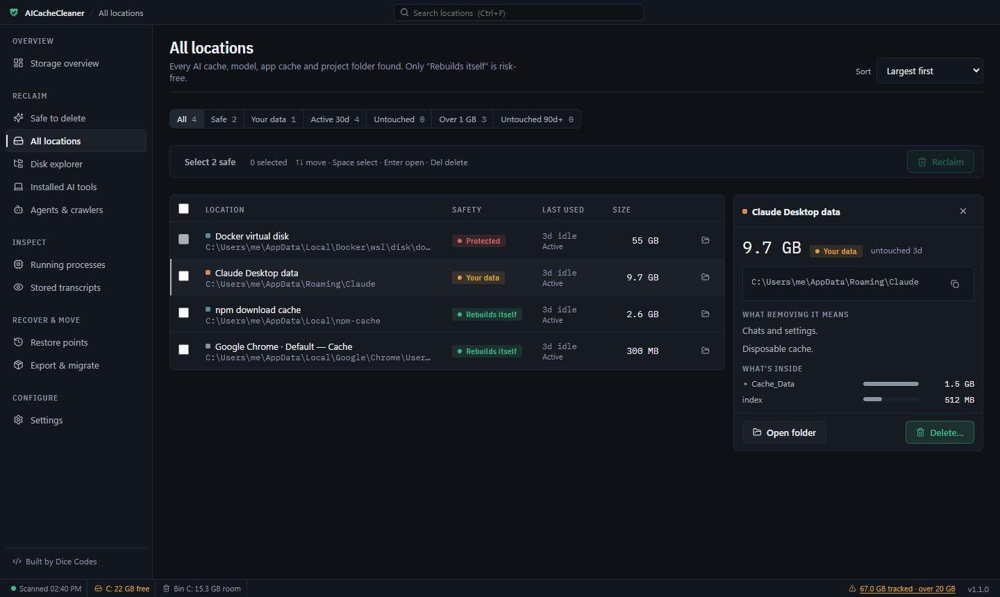
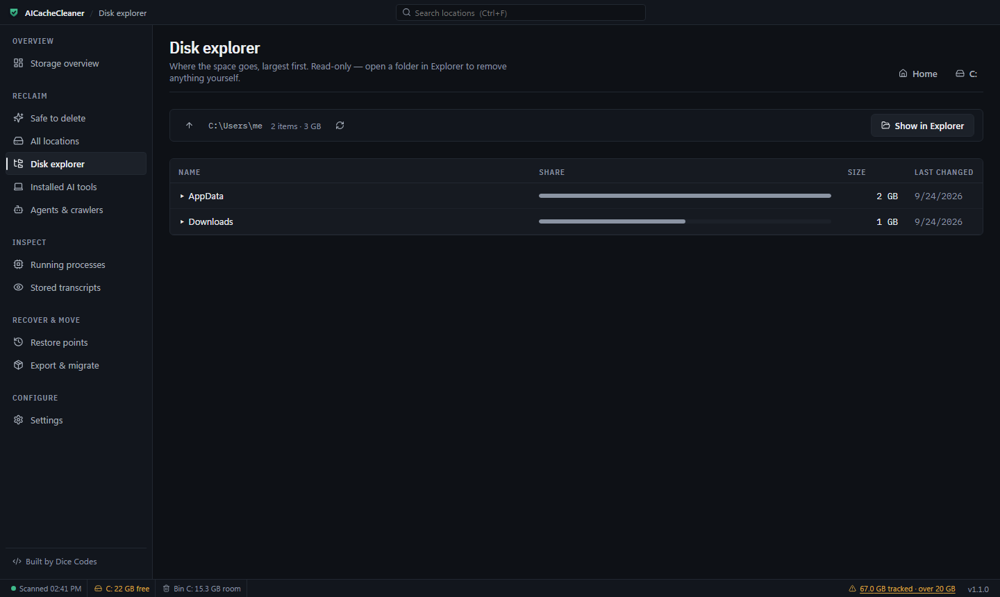
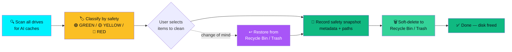

# AICacheCleaner — Clean Claude, Cursor & Ollama Cache to Free Up Disk Space

> **100% Safe On-Demand AI Disk, Memory & Cache Cleaner for Windows.**
> Free up disk space by safely clearing Claude Desktop cache, Cursor cache, Ollama model weights, and Antigravity / Gemini AI storage — with automatic safety restore points.

[](https://opensource.org/licenses/MIT)
[](https://github.com/IamRamgarhia/AICacheCleaner/releases)
[](#-100-on-demand-security-guarantee)
[](https://github.com/IamRamgarhia/AICacheCleaner/releases/latest)
[](https://iamramgarhia.github.io/AICacheCleaner/)

<p align="center">
  
</p>

<p align="center">
  <a href="https://github.com/IamRamgarhia/AICacheCleaner/releases/latest/download/AICacheCleaner-Portable.exe">
    
  </a>
  <br />
  <sub>One file, no install · always the newest release · <a href="https://github.com/IamRamgarhia/AICacheCleaner/releases">all versions &amp; changelog</a></sub>
</p>

---

## 📸 Screenshots

<table>
  <tr>
    <td width="50%" align="center"><b>Storage overview — everything AI stores, by tool</b></td>
    <td width="50%" align="center"><b>All locations — safety rating and what's inside</b></td>
  </tr>
  <tr>
    <td></td>
    <td></td>
  </tr>
  <tr>
    <td colspan="2" align="center"><b>Disk explorer — where the space goes, filling in live</b></td>
  </tr>
  <tr>
    <td colspan="2"></td>
  </tr>
</table>

> Screenshots use demo data, so no real paths from any machine are shown.

---

## 💡 What is AICacheCleaner?

**AICacheCleaner** is a free, open-source desktop app that helps you **clean Claude Desktop cache, clear Cursor cache, free up Ollama disk space, and reclaim tens of gigabytes of hidden AI storage** — without touching your project code, chat history, or settings.

When you use modern AI tools — **Claude Desktop, Cursor AI, Google Antigravity, Ollama, Continue.dev, LM Studio, Jan.ai** — they silently build up prompt caches, V8 bytecodes, GPU shader caches, diagnostic logs, and downloaded model weights across your drives. Over weeks these consume tens of gigabytes and slow your PC.

AICacheCleaner scans every drive, classifies each cache by safety (🟢 100% Safe / 🟡 Review / 🔴 Protected), and lets you **free up disk space** in one click — with an automatic safety restore point created before anything is touched.

### 🎯 Built for these exact problems

| People search for | AICacheCleaner does it |
|---|---|
| "how to clean Claude Desktop cache" | Clears `%AppData%\Claude\Cache`, `Code Cache`, `GPUCache`, and `logs` (GREEN, 100% safe) |
| "clear Cursor cache windows" | Clears `%AppData%\Cursor\Cache\Cache_Data` and `CachedData` (rebuilds on launch) |
| "free up Ollama disk space" | Surfaces `~/.ollama/models` weights (4–20 GB each) for review |
| "Antigravity / Gemini storage too big" | Inspects `~/.gemini` brain state, transcripts, skills |
| "what is eating my disk space" | Non-overlapping multi-drive footprint with deduplication |

---

## 🧩 Supported AI Tools & Caches

AICacheCleaner detects and cleans caches for these tools. GREEN = 100% safe to delete (auto-rebuilds); YELLOW = contains user data, review before cleaning.

| Tool | Cache Location (Windows) | Safety Tier |
|---|---|---|
| **Claude Desktop** | `%AppData%\Claude\Cache`, `Code Cache`, `GPUCache`, `logs` | 🟢 GREEN |
| **Claude Desktop** (chat data) | `%AppData%\Claude` (session keys, MCP configs, chat DB) | 🟡 YELLOW |
| **Claude CLI** | `~/.claude` (session logs, transcripts) | 🟡 YELLOW |
| **Cursor AI** | `%AppData%\Cursor\Cache\Cache_Data`, `CachedData` | 🟢 GREEN |
| **Cursor AI** (user data) | `~/.cursor`, `%AppData%\Cursor\User` | 🟡 YELLOW |
| **Google Antigravity / Gemini** | `~/.gemini` (brain state, transcripts, plugins, skills) | 🟡 YELLOW |
| **Ollama** | `~/.ollama/models` (LLaMA, Qwen, DeepSeek weights) | 🟡 YELLOW |
| **HuggingFace** | `~/.cache/huggingface` (model weights, tokenizers) | 🟡 YELLOW |
| **PyTorch** | `~/.cache/torch` (model checkpoints) | 🟡 YELLOW |
| **Continue.dev** | `~/.continue` (vector index, SQLite session DB) | 🟡 YELLOW |
| **LM Studio** | `~/.cache/lm-studio` (GGUF models) | 🟡 YELLOW |
| **Jan.ai** | `%AppData%\Jan` (local model files) | 🟡 YELLOW |
| **AnythingLLM** | `%AppData%\AnythingLLM` (vector DB, embeddings) | 🟡 YELLOW |
| **pip / npm / Bun / Yarn / uv** | Package download caches (`%LOCALAPPDATA%
pm-cache`, `~/.bun`, …) | 🟢 GREEN |
| **Codex, OpenCode, agents** | Discovered automatically by directory signature | 🟡 YELLOW |

Beyond the fixed list above, AICacheCleaner **discovers** AI tool directories across your home folder, `%APPDATA%`, `%LOCALAPPDATA%` and `Program Files` by matching vendor signatures — so tools it has never heard of still show up with their real disk usage.

---

## 📥 Download AICacheCleaner (v1.3.0)

**Zero installation** — download the portable build and double-click to run.

| OS | File | Size | Download |
| :--- | :--- | :--- | :--- |
| 🪟 **Windows 10/11** | `AICacheCleaner-Portable.exe` | ~80 MB | [⚡ Download the latest Windows Portable](https://github.com/IamRamgarhia/AICacheCleaner/releases/latest/download/AICacheCleaner-Portable.exe) |

**Prefer a normal installed program?** After launching the portable build, open **Settings → Install as Native Windows App** to register it with Start Menu + Control Panel (the installer is generated from inside the app — no separate download).

> 🍏 **macOS:** coming in a future release. The v1.0.0 macOS artifact was an incomplete build and has been removed. Star ⭐ the repo to be notified when the macOS `.dmg` ships.

> ⚠️ **On v1.0.0? Update now.** Cleaning did not work in that build — a bundling bug meant every delete silently failed. Fixed and verified in v1.1.0. See the [changelog](CHANGELOG.md).

> All releases: [github.com/IamRamgarhia/AICacheCleaner/releases](https://github.com/IamRamgarhia/AICacheCleaner/releases)

---

## ✨ Key Features

### 1. 🔍 Non-Overlapping AI Storage Detector
Scans all drives (`C:`, `D:`, `E:`, `F:`, external) for active AI project footprints, model weights, and prompt caches. Uses **ancestor-descendant path deduplication** so nested subfolders are never double-counted.

### 2. 🛡️ Restore Points With Real One-Click Recovery
Before anything is removed, AICacheCleaner writes a record of exactly what will be cleaned and from where. Items are soft-deleted to the **Windows Recycle Bin** — and the Restore Points screen moves them back out of it automatically, to their original location or a folder you choose. You never have to dig through the Recycle Bin by hand.

*Automatic restore is currently Windows-only; on other platforms the record is still written but recovery is manual.*

### 3. 📦 Export AI Chat History Per Project — Move Work to a New PC
Pick a project and get its source code **plus every AI conversation about it** in one `.zip`. Claude records a working directory in each session and Cursor stores a workspace folder, so **your chat history is matched to the right project automatically** — no hunting through `~/.claude` by hand. Archives stream to disk, so **there is no size limit**: a 2.4 GB project with 604 MB of chat history exports fine.

Answers: *"how do I move my Claude chat history to a new computer"*, *"backup Cursor AI chat history"*, *"export AI conversations per project"*, *"migrate AI coding setup to new PC"*.

### 4. 🧹 Clean npm, pip, Bun, Yarn & uv Caches
Every AI tool, MCP server and coding agent pulls packages through these. They re-download on demand, so they are **100% safe to delete** — and usually the single largest reclaimable thing on a developer's disk. On the development machine this alone took reclaimable space from **327 MB to 3.44 GB**.

### 5. 🖥️ Windows Native Uninstaller Integration
Triggers the official Windows Add/Remove Programs panel (`appwiz.cpl` / `ms-settings:appsfeatures`) after creating a safety snapshot, for clean software uninstallation.

### 6. 🤖 Autonomous Agents & Web Crawler Scanner
Detects installed and residual scraping engines including **OpenDevin, Crawl4AI, Playwright, and Puppeteer** headless browser binaries.

### 7. 🧟 Idle Process Inspector
Names every AI process from its real command line ("MCP server: @playwright/mcp", "Claude Code (in Antigravity)"). A process is only called **idle** when its parent app has closed, it has no window, it holds 150 MB+ and it has done no CPU work for 10 minutes. Stopping one always asks first, and only works on processes the app listed.

### 8. 🧯 Deletes That Can't Go Wrong
Everything goes to the **Recycle Bin**, after a caution dialog that shows what is inside the folders. If Windows would delete something permanently instead — too big for the bin, a drive without a bin, or a selection that would push your older recycled files out — the whole delete is **refused** and nothing is touched. Folders holding code, git repositories, databases or logins are locked.

### 9. 🌐 Every Chromium App's Cache, Found Automatically
Chrome, Edge, Brave, VS Code, Slack, Discord, WhatsApp, Claude and any other Electron app keep disposable web, code and GPU caches. They're found by their profile layout, not a hand-kept list — plus **Chrome's 4 GB on-device Gemini Nano model** and individual Hugging Face, Ollama and LM Studio models.

### 10. 🐳 Docker Disk Space You Can Get Back
Docker's virtual disk never shrinks on its own. The dashboard shows how much of it is empty space (44 GB of 55 GB on the development machine) and gives the exact, safe steps to return it to Windows — images, containers and volumes are kept.

### 11. 🗂️ Disk Explorer & Windows Tips
Browse any drive largest-first, filling in live. Guided, copy-paste steps for the hibernation file, Windows Update leftovers, NVIDIA driver downloads and old downloads — the app never touches these itself.

### 12. ⌨️ Built Like Desktop Software
Native title bar and dialogs, status bar with free space and Recycle Bin room, split view with details, right-click menus, tray icon, and keyboard control: **Ctrl+F** search, **↑/↓** move, **Space** select, **Enter** open, **Delete** delete (it still asks), **Ctrl+R** rescan, **Ctrl+1…9** switch pages.

### 13. 🧭 Everything AI on Your PC, in One List
Installed AI tools now lists **AI apps and agents**, **AI models** (LLMs in Ollama / LM Studio / Hugging Face plus image, video and speech models from ComfyUI, Forge, Fooocus, InvokeAI, Stability Matrix, Pinokio, Whisper, rembg), **apps with AI built in**, the **runtimes AI relies on** (Docker Desktop, WSL, Python, Node.js, Git, .NET, CUDA…) and **packages AI tools installed** (npm globals, Python AI libraries, uv/pipx tools) — read from Windows' installed-programs list, with each app's real icon. Runtimes and packages are shown for information only.

### 14. 🐳 Docker & WSL Breakdown
Images, containers, volumes and build cache with their sizes. Build cache and dangling images can be cleaned (they rebuild themselves); everything else is a copy-paste command with a plain warning. Every WSL distro's disk with the steps to compact it.

### 15. 🧬 Duplicate Models & Old Project Clutter
The same model stored twice across Ollama, LM Studio and Hugging Face (every byte compared before a copy can move), and `node_modules` / virtual environments / build output in projects you haven't touched for weeks — all to the Recycle Bin, never permanently.

### 16. 🔌 MCP Servers & Growth Over Time
Every MCP server configured in Claude, Cursor, VS Code, Windsurf, Gemini, Codex and friends, merged into one list with what's running and its memory (API keys are never shown). The overview charts how your AI storage grows, with an optional once-a-day notification when it passes your limit.

---

## ⚖️ AICacheCleaner vs CCleaner / BleachBit / Manual Cleanup

Generic cleaners like **CCleaner** and **BleachBit** are great for browser and system junk — but they have **no idea that Claude Desktop, Cursor, Ollama, Antigravity, or HuggingFace even exist**. Their "AI cache" knowledge is zero, so they either skip these caches entirely or, worse, nuke user data because they can't tell `Claude\logs` apart from `Claude\sessionDB`.

| Capability | AICacheCleaner | CCleaner | BleachBit | Manual (Explorer) |
|---|:---:|:---:|:---:|:---:|
| Knows Claude Desktop cache paths (`Cache`, `GPUCache`, `Code Cache`, `logs`) | ✅ | ❌ | ❌ | ❌ |
| Knows Cursor cache paths (`Cache_Data`, `CachedData`) | ✅ | ❌ | ❌ | ❌ |
| Detects Ollama / HuggingFace / PyTorch model weights | ✅ | ❌ | ❌ | ❌ |
| Knows Antigravity / Gemini `.gemini` brain & transcripts | ✅ | ❌ | ❌ | ❌ |
| Distinguishes 100%-safe caches from protected user data (chat DB, session keys) | ✅ | ⚠️ partial | ⚠️ partial | ❌ |
| Automatic safety restore point before every clean | ✅ | ❌ | ❌ | ❌ |
| Soft-deletes to Recycle Bin / Trash (recoverable) | ✅ | ⚠️ optional | ⚠️ optional | ✅ |
| Detects AI zombie processes in RAM | ✅ | ❌ | ❌ | ❌ |
| 100% offline, no telemetry | ✅ | ❌ | ✅ | ✅ |
| Free & open source | ✅ MIT | ❌ | ✅ GPL | ✅ |

> **The short version:** use CCleaner/BleachBit for browser junk, and AICacheCleaner for your AI tool clutter. They're complementary, not replacements.

---

## 📊 Real-World Impact — How Much Space Can You Reclaim?

Measured on the development machine (Windows 11, 300 GB C: drive with 22 GB free), September 2026:

| What | Tool | Size | How it's reclaimed |
|---|---|---|---|
| Empty space inside `docker_data.vhdx` | Docker Desktop | **44.8 GB** (of a 55.4 GB file) | Guided `diskpart` compact — images and volumes kept |
| Caches that rebuild themselves | npm, pnpm, Composer, uv, app caches… | **11.5 GB** | Recycle Bin, after confirmation |
| Hibernation file, update leftovers, driver downloads | Windows | **16.4 GB** | Guided steps (`powercfg`, Disk Cleanup) |
| On-device AI model (`OptGuideOnDeviceModel`) | Chrome | **4.0 GB** | Chrome Settings → System → On-device AI |
| Chromium/Electron app caches | Chrome, Edge, WhatsApp, Claude… | **2.6 GB** across 78 folders | Recycle Bin |

Your figures depend on which tools you use — run a scan to see your own.

---

## 💻 Use Cases by Platform & Scenario

AICacheCleaner is built for the specific cleanup jobs people search for on Windows.

### 🪟 Windows 10 / 11

- **Windows 11 cache cleaner for AI tools** — clears `%AppData%\Claude`, `%AppData%\Cursor`, `%LOCALAPPDATA%` caches
- **Free up C: drive space** when it's full of Claude Desktop and Cursor caches
- **Clean Ollama models on Windows** — review `~/.ollama/models` and remove unused LLaMA/Qwen/DeepSeek weights
- **Fix Cursor lag** by clearing stale `CachedData` that bloats startup time
- **Uninstall AI software cleanly** — launches native Windows `appwiz.cpl` after snapshotting

### 🎯 By scenario

| If you're searching for… | AICacheCleaner is the disk cleanup tool that… |
|---|---|
| *"My C: drive is suddenly full"* | Scan all drives, find the 20–60 GB of hidden AI caches |
| *"Cursor is slow to start"* | Clear old `CachedData` V8 bytecodes |
| *"Claude Desktop is sluggish"* | Clear `Cache`, `GPUCache`, and accumulated `logs` |
| *"Ollama ate my storage"* | Review and remove unused downloaded model weights |
| *"My RAM is full of zombie processes"* | Inspect and terminate orphaned AI sidecars |

---

## 🧠 How It Works — Safe Cleanup Pipeline

Every clean follows the same auditable pipeline. A safety snapshot is recorded first, items are soft-deleted to the OS Recycle Bin / Trash, and nothing is ever permanently destroyed without a recovery path.



> **Why soft-delete instead of permanent delete?** Every cleaned item goes to your operating system's Recycle Bin (Windows) or Trash (macOS). If you ever change your mind, restoration is one click — and the snapshot record tells you exactly what was cleaned and from where.

---

## ❓ How do I clean … cache? (FAQ)

**How do I clean Claude Desktop cache?**
Open AICacheCleaner → the Claude Desktop entries under the GREEN tier (`Cache`, `Code Cache`, `GPUCache`, `logs`) are 100% safe — select them and click **Clean**. Your chat history and settings are never touched.

**How do I clear Cursor cache?**
The Cursor `Cache_Data` and `CachedData` (V8 bytecode) entries are GREEN — they rebuild automatically on the next launch. Select and clean; no settings or extensions are affected.

**How do I free up Ollama disk space?**
AICacheCleaner lists `~/.ollama/models` under YELLOW (each model is 4–20 GB). Review the list, keep the models you use, and clean the rest. Ollama will re-download a model on demand.

**Is AICacheCleaner safe to use on my development machine?**
Yes. It uses strict safety tiers: GREEN items (temporary webview graphics, V8 bytecodes, GPU shaders, logs) are 100% safe and auto-rebuild. YELLOW user data (chat databases, session keys) is never auto-deleted.

**How do I move my AI chat history to a new computer?**
Open **PC Migration → Export one project**, pick the project, and it packages the source plus every linked AI conversation into one `.zip`. Copy it across and unpack. There is no size limit.

**Can I export just one project instead of everything?**
Yes — that is the default. Exporting a whole tool means packaging every project you have ever touched (Antigravity alone can be 20 GB+). Per-project export gives you only what you need.

**Is it safe to delete the npm or pip cache?**
Yes. They are download caches — npm and pip refetch anything they need on the next install. Your installed `node_modules` and site-packages are untouched. These are often the biggest safe win on a developer's machine.

**How do I undo a clean?**
Open **Restore Points** and click **Restore these files**. Cleaned items go to the Windows Recycle Bin and the app moves them back automatically — you do not have to dig through the bin yourself.

**Does AICacheCleaner run automatically in the background?**
**No.** It operates on a strict **100% On-Demand** guarantee — no autostart entries, no background services, no daemons. It runs only when you open it.

---

## 🔒 100% On-Demand Security Guarantee

> **AICacheCleaner NEVER runs in the background.**

- **0 Background Services** — no autostart daemons, agents, or Windows services.
- **100% Local Execution** — all scanning, size calculation, and process inspection happen on your computer. Zero data leaves your machine.
- **100% Open Source** — fully transparent, inspectable code under the MIT license.
- **Sandboxed Electron** — `contextIsolation: true`, `nodeIntegration: false`, with a dedicated preload bridge. CORS is locked to localhost only.

---

## 🛠️ Local Development & Quick Start

```bash
# 1. Clone the repository
git clone https://github.com/IamRamgarhia/AICacheCleaner.git
cd AICacheCleaner

# 2. Install dependencies
npm install

# 3. Start development (frontend + backend)
npm run dev

# 4. Build the Windows portable executable
npm run build:win-portable    # produces dist-electron/AICacheCleaner-Portable-1.3.0.exe
```

---

### Signing builds (maintainers)
Unsigned builds show a Windows SmartScreen warning on first run. electron-builder signs automatically when a code-signing certificate is provided:

```bash
set CSC_LINK=C:\path\to\certificate.pfx
set CSC_KEY_PASSWORD=your-password
npm run build:win-portable
```

Never commit the certificate or its password.

### Tests
```bash
npm test                 # unit + integration (51), incl. a real Recycle Bin round trip on Windows
npm run test:e2e         # UI flows against a mocked engine
set AICC_ELECTRON=1 && npx playwright test e2e/electron.spec.ts   # the Electron shell
```

## 📜 License & Credits

Distributed under the **MIT License**. Created with ❤️ by **[Dice Codes](https://dicecodes.com/)** & **[IamRamgarhia](https://github.com/IamRamgarhia)**.

⭐ **If AICacheCleaner freed up space for you, please star the repo** — it helps other developers find it.
